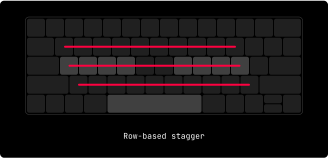
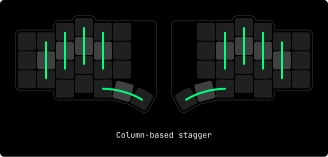
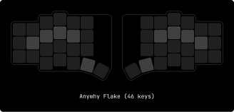
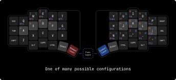
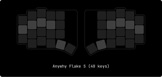
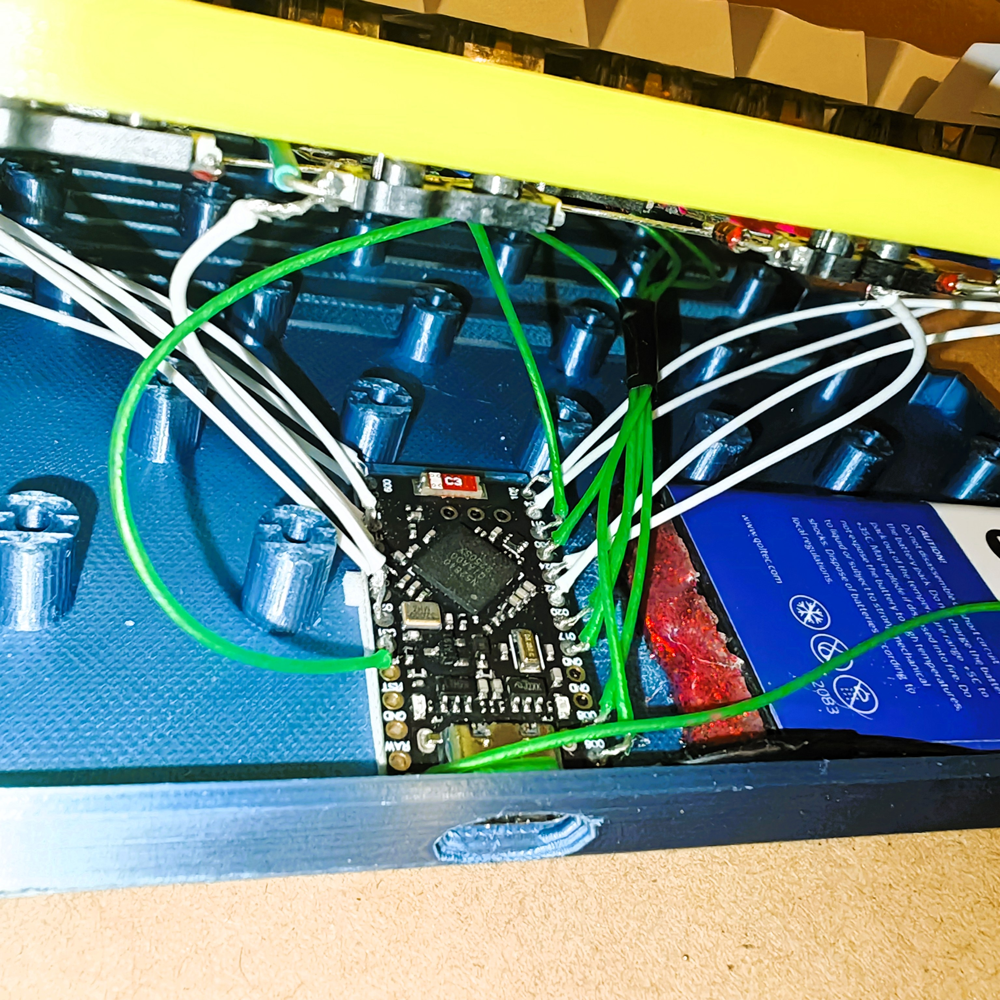
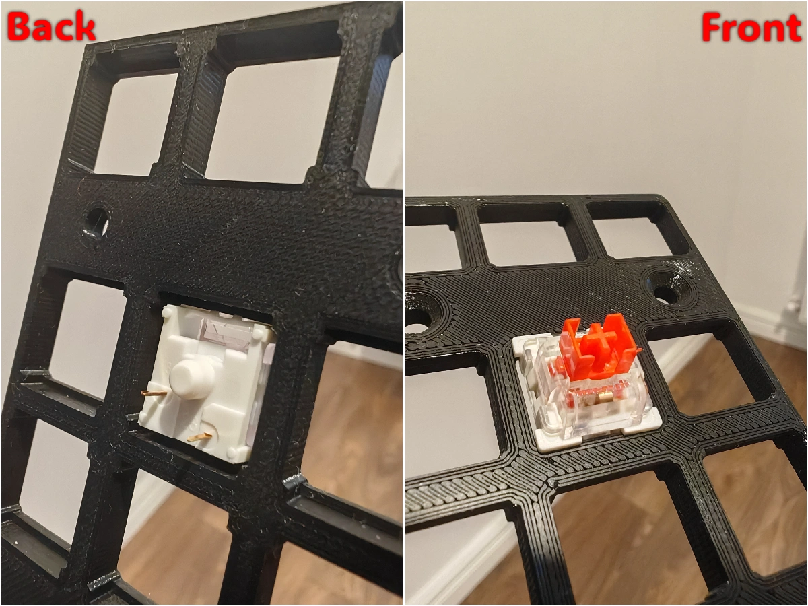

    
    <h3>TBK split TKL</h3>

# Why

It saves desk space, making it ideal for smaller workspaces or for users who prefer a minimalist setup.

The absence of the numeric keypad also brings the mouse closer to the keyboard, reducing the distance the hand needs to travel and thus improving ergonomics.

This setup is particularly beneficial for gamers and those who frequently switch between the keyboard and mouse.

# How

A tenkeyless (TKL) keyboard is used in the same way as a standard keyboard but without the numeric keypad on the right side.

This layout retains all the essential keys, including the function row, arrow keys, and navigation cluster, making it suitable for most typing and gaming tasks.

Users simply type and interact with their computer as they would with a full-sized keyboard, but with a more compact and portable design.
<!--
## Stagger

If you take your hand and look at the fingers, you can notice that they are positioned horizontally. Now take a look at your keyboard - the keys are grouped in arrays that are shifted vertically, known as row-based stagger.

This well-known layout forces your fingers to move in a counterintuitive way. The solution to that problem is simple: we need to rearrange the keys in a more human-friendly way.

As you can see, Flake has what's called a column-based stagger. Because of this, keys are located in the path of natural finger movement, which results in a much more pleasant typing experience and reduced fatigue.

## Split

One of the most noticeable things about Flake is that it has two separate halves.

Regular keyboards are made in a single monolithic block, and the main problem is that such a form factor requires our forearms to meet in the center. To compensate for this, wrists are bent apart. This position creates an unnatural angle between the forearm and the wrist, which in the long term will likely lead to constant wrist pain.

Each half of the split keyboard can be rotated and placed in any suitable way so everyone can adapt the setup to their personal preference, avoiding potential damage to the wrists.

As an added bonus, we get free space right between the halves which can be occupied by a trackpad, coffee, or even a cat (=^..^=).

## Keys amount

There's a high chance that some might feel confused seeing such a small number of keys, considering user productivity is one of the priorities for Anywhy.

Indeed, Flake has fewer keys than most conventional keyboards (46 keys in total), and that's not a compromise, but a feature. A large number of keys causes hands to move around to reach further-placed keys like digits, brackets, punctuation, Backspace, Escape, etc.

Having fewer keys doesn't mean less functionality. In fact, Flake is not only fully input-compatible with regular keyboards but also allows you to add more keys than most keyboards have.

By default, Flake uses [ZMK Firmware](https://zmk.dev) which provides functionality that significantly increases productivity. One of the most used features, which allows having all possible inputs with a minimal amount of keys, is [layers](https://zmk.dev/docs/keymaps#layers). They are pretty simple and work just like the well-known Shift key.

For those who strive for absolute comfort and compactness, there is also Flake S with 40 keys.

The small version lacks one outer column on each of the halves to reduce pinky usage, as it is the weakest of all fingers.

## Thumb cluster

Keyboards are used in various ways, not only for typing text. Most popular tasks require the use of mod keys such as Control, Alt/Option, Super/Command/Win, and of course, Shift. Even though these keys are regularly used, they are placed in ridiculously inconvenient spots where only the pinky can reach them, and as we already know, it's the weakest finger.

The Flake keyboard has a so-called thumb cluster which contains 10 keys in total to address that problem. In contrast, the thumb is one of the strongest fingers and is ideal for holding mod keys.
-->
# What

TBK split TKL supports both wired and wireless (Bluetooth) connection, which makes it perfect for both home usage with a PC or portable setup with a laptop, tablet, or even smartphone.

To achieve both types of connectivity, each half has a USB-C port. The left half can be connected to any device using the USB port or using Bluetooth.

The right half will connect wirelessly to the left and can be charged using the USB port.

The keyboard body is thin. Without switches and feet its height is at most 10mm in height, which makes it compact and really comfortable to use.

> Unfortunately, to achieve such a low height, some tradeoffs were made in the enclosure design that make assembly a bit tricky.

Talking about switches, the keyboard is hot-swappable and supports the well-known Cherry MX compatible switches.

> Feel free to send me your builds and keyboard reviews :)

# Credits

Huge thanks to:

- [Mad Mod Labs](https://www.youtube.com/c/MadModLabs), the author of [65% MML KEYBAR](https://www.printables.com/model/455365-mechanical-keyboard-69-key-65-mml-keybar)
  
- [Joe Scotto](https://www.youtube.com/c/JoeScotto), the author of [ScottoKeebs](https://scottokeebs.com/), an extensive collection of freely available handwired keyboard and macropad projects.
  
- [Pete Johanson](https://github.com/petejohanson) for creating [ZMK Firmware](https://github.com/zmkfirmware/zmk) and all the [contributors](https://github.com/zmkfirmware/zmk/graphs/contributors) that make it better each day.
